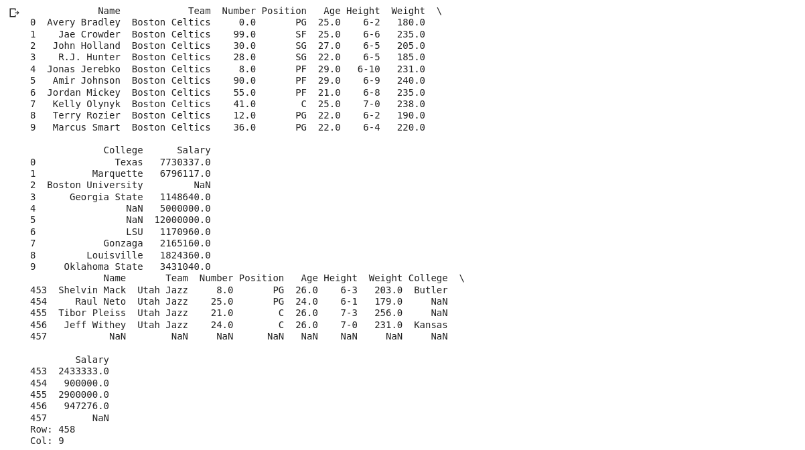

# Read-from-CSV

## AIM:
To develop a python program to read the contents of csv file.

## ALGORITHM:
### Step 1:
Start the python.
### Step 2:
Import pandas.
### Step 3:
Mention the CSV file which is to be read.
### Step 4:
Read the contents of the CSV file using df.read function.
### Step 5:
End the program.
## PROGRAM:
```
Developed by : JANANI.S
Register Number: 22008491
import pandas as pd
f=pd.read_csv('/content/nba.csv')
print(f.head(10))
print(f.tail())
print('Row:',len(f.axes[0]))
print('Col:',len(f.axes[1]))
```
## OUTPUT:


## RESULT:
Thus a program to read the contents of csv file using the python programming language.